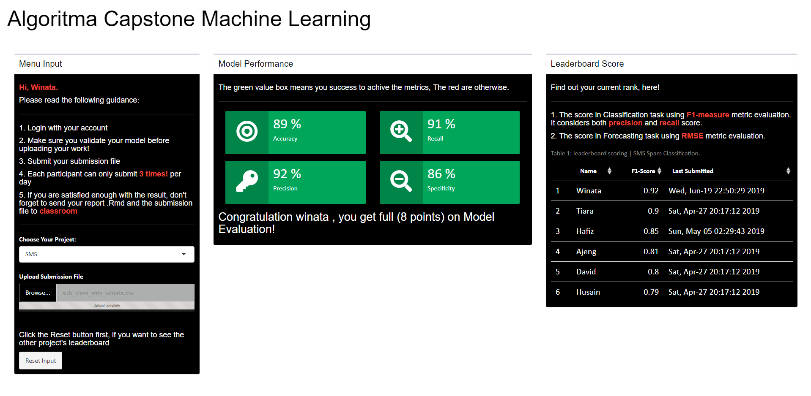

The Score Leaderboard Machine Learning Capstone
===============================================

Problems:

1.  **Scotty** : Forecast Hourly Demands for Scotty.

2.  **Scotty** : Classify “nodrivers” Condition by Region and Hour.

3.  **SMS** : I didn’t get your message!

4.  **F&B** : How much our total revenue will be?

-   The score in Classification task using `F1-measure` metric evaluation. It
    considers both precision and recall score.

-   The score in Forecasting task using `RMSE` metric evaluation.

Feature:
========

Next Update
===========

1.  Updating Case studies evaluation script.
